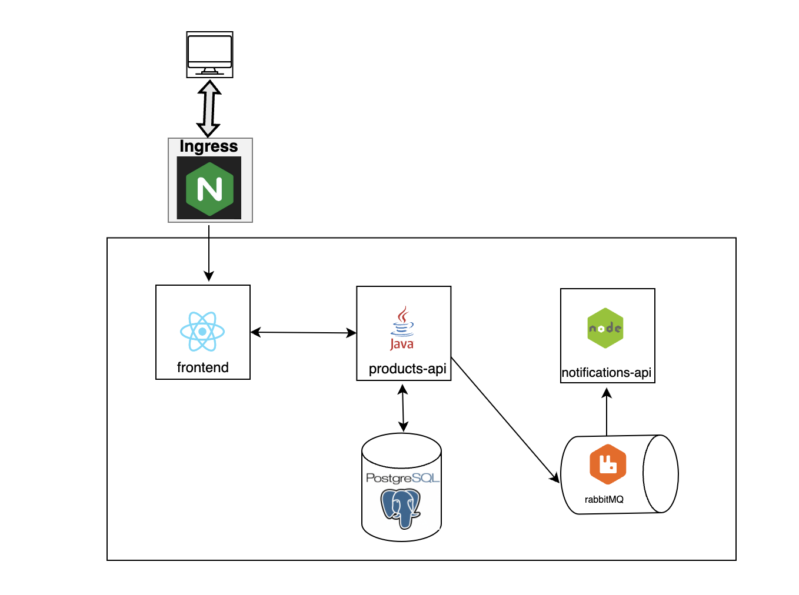

**Zadanie zaliczeniowe**

W ramach kursu chcemy, abyś samodzielnie przygotował projekt zaliczeniowy - aplikację store-app - którego pierwsza część polegać będzie na konteneryzacji komponentów sklepu internetowego:
* store-frontend (React) - aplikacja webowa, komunikująca się z products-api, nasłuchująca na porcie **3000**
* products-api (Java) - API restowe dla produktów i zamówień, nasłuchujące na porcie **8080**
* notifications-api (JavaScirpt) - wysyłanie powiadomień dla klientów o statusie realizacji zamówienia, nasłuchujące na porcie **5001**
* baza danych (MySQL) - przechowywanie danych na temat produktów i zamówień
* system kolejkowy (RabbitMQ) - do komunikacji z notifications-api

Frontend komunikuje się z products-api, aby wyświetlac produkty dostępne w sklepie oraz móc składac zamówienia.
Products API pozwala na:
* otrzymanie listy dostępnych produktów
* dodanie produktu
* utworzenie zamówienia
* otrzymanie listy zamówień
* zmiana statusu zamówienia

Jeśli zamowienie zmienia status, wówczas zostaje wysłana z products-api wiadomośc na kolejkę. Notifications-api pobiera
wiadomości z kolejki i wysyła powiadomienia do użytkownika o zmianie statusu zamówienia. Z bazą danych komunikuje się tylko
products-api. 

Kod zawiera wszystko skonfigurowane tak, aby zadziałało dopiero po wykonaniu części drugiej zadania.

Zmienne środowiskowe:
* RabbitMQ
  * RABBITMQ_HOST
  * RABBITMQ_PORT
  * RABBITMQ_QUEUE_NAME
* PostgreSQL
  * POSTGRESQL_HOST
  * POSTGRESQL_PORT
  * POSTGRESQL_USERNAME
  * POSTGRESQL_PASSWORD
  * POSTGRESQL_DATABASE

Obrazy każdego komponentu umieść w swoim repozytorium DockerHub.
Przygotuj plik docker-compose.yaml dla całej aplikacji.

Druga częś zadania polega na orkiestracji Kubernetesem całej aplikacji, przy uwzględnieniu następujących założeń:
* liczba replik frontendu - 3
* liczba replik products-api - 2
* liczba replik notifications-api - 2
* liczba replik bazy danych - 1
* liczba replik systemu kolejkowego - 1

Gotowe rozwiązanie, zawierające pliki Dockerfile (pamiętaj o plikach _.dockerignore_) z pierwszej części zadania oraz pliki manifestu Kubernetesa umieść w repozytorium GitHub, a link prześlij do mentora.

Schemat całego rozwiązania:
